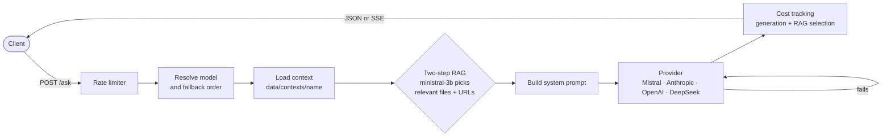

# Rukh

[](https://github.com/w3hc/rukh/actions/workflows/test.yml)
[](LICENSE)

A [NestJS](https://nestjs.com) starter kit for shipping your own AI agent as an API. Drop markdown files in a folder, and Rukh answers questions about them through whichever LLM is up, telling you what each answer cost.

Where a plain provider SDK gives you one model and a raw completion, and LangChain gives you building blocks to assemble, Rukh is a running service you fork and make your own: one `/ask` endpoint, already wired to four providers, contexts, RAG, auth and rate limits.

- API: **[rukh.w3hc.org](http://rukh.w3hc.org)**
- UI: **[rukh.it](https://www.rukh.it/)** (source: [rukh-ui](https://github.com/w3hc/rukh-ui))

## Features

- **Multi-provider with fallback**: Mistral, Anthropic, OpenAI and DeepSeek behind one `model` parameter. If the chosen provider fails, the next one takes over. See [docs/MODELS.md](docs/MODELS.md).
- **Streaming**: `stream=true` returns server-sent events, with fallback up to the first byte. See [docs/STREAMING.md](docs/STREAMING.md).
- **File-based contexts + RAG**: a context is a folder of markdown files and URLs under `data/contexts/`. A cheap first pass picks the files relevant to the question, and only those reach the model. See [docs/CONTEXT_MANAGEMENT.md](docs/CONTEXT_MANAGEMENT.md).
- **Per-call cost tracking**: every response carries its token usage and its cost in USD, RAG selection included.
- **SIWE auth**: managing contexts (create, upload, delete) requires a [Sign-In with Ethereum](https://login.xyz) signature from the context's creator.
- **Rate limiting**: per-IP limits on `/ask` and `/web-reader`, configurable through env vars.
- **Sessions**: pass back the `sessionId` to keep the conversation going.

## Architecture



1. `/ask` goes through the per-IP rate limiter.
2. Rukh picks the model: the context's `model` override if its `index.json` sets one, then the request's `model`, then `anthropic`. The other providers line up behind it as fallbacks.
3. It loads the context (`rukh` by default). When the context has files or URLs to choose from, a cheap `ministral-3b` call selects the relevant ones, and only those go into the system prompt.
4. The first provider in line answers. If it fails, the next one takes over, as JSON or as server-sent events.
5. The response carries token usage and cost, with the RAG selection cost added on.

The code follows the same path: [src/app.controller.ts](src/app.controller.ts) → [src/app.service.ts](src/app.service.ts) (`prepareAsk`) → [src/rag/rag.service.ts](src/rag/rag.service.ts) → one of the provider services ([src/anthropic/](src/anthropic/), [src/mistral/](src/mistral/), [src/openai/](src/openai/), [src/deepseek/](src/deepseek/)) → [src/memory/cost-tracking.service.ts](src/memory/cost-tracking.service.ts).

## Install

Requires Node 24.

```bash
pnpm i
```

## Test

```bash
# format, lint, build, test, and test:e2e
pnpm dance
```

Or separately: 

```bash
# unit tests
pnpm test

# e2e tests
pnpm test:e2e

# test coverage
pnpm test:cov
```

## Run

```bash
pnpm start
```

The Swagger UI should be available at http://localhost:3000/api

## Example

Simple request: 

```bash
curl 'https://rukh.w3hc.org/ask' \
  -H 'Content-Type: multipart/form-data' \
  -F 'message=What'\''s Rukh?' \
  -F 'context=rukh'
```

Response body:

```json
{
  "output": "**Rukh** (also spelled roc, ruḵḵ, or rokh) is an enormous legendary bird of prey from Middle Eastern mythology and folklore.",
  "model": "claude-sonnet-5",
  "sessionId": "15a7e248-17f2-4b9e-a42b-000f97a075e7",
  "usage": {
    "input_tokens": 1930,
    "cache_creation_input_tokens": 0,
    "cache_read_input_tokens": 0,
    "cache_creation": {
      "ephemeral_5m_input_tokens": 0,
      "ephemeral_1h_input_tokens": 0
    },
    "output_tokens": 352,
    "service_tier": "standard",
    "inference_geo": "not_available"
  },
  "cost": {
    "input_cost": 0.003866,
    "output_cost": 0.00352,
    "total_cost": 0.007386
  },
  "rag": {
    "selectedFiles": ["rukh-definition.md"],
    "selectedUrls": [],
    "totalFilesAvailable": 1,
    "totalUrlsAvailable": 0,
    "selectionMethod": "rag-two-step",
    "selectionCost": {
      "input_cost": 0.000006,
      "output_cost": 0,
      "total_cost": 0.000006
    }
  }
}
```

## License

[LGPL-3.0](LICENSE)

## Contact

https://julienberanger.com/contact